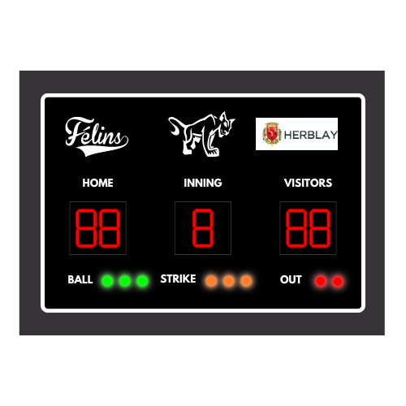
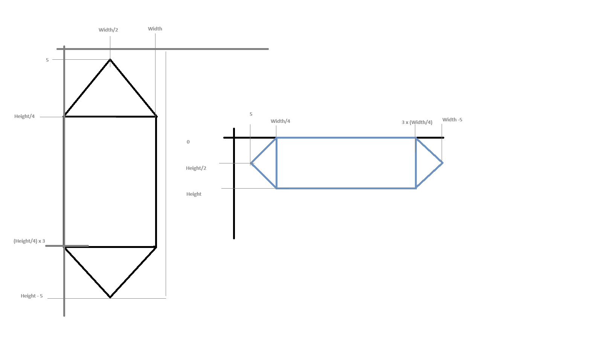
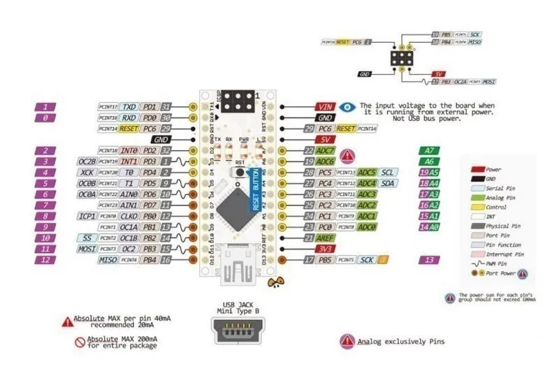
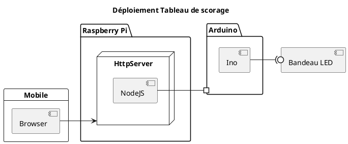

# Tableau de scorage

- [Tableau de scorage](#tableau-de-scorage)
  - [Segment](#segment)
    - [Dimension](#dimension)
  - [Digit](#digit)
  - [Chiffre](#chiffre)
  - [LED de comptage](#led-de-comptage)
    - [Ensemble de LED de comptage](#ensemble-de-led-de-comptage)
  - [Composants du tableau de scorage](#composants-du-tableau-de-scorage)
  - [Séquence de test](#séquence-de-test)
  - [Arduino UNO](#arduino-uno)
  - [Communication](#communication)

Le but est de concevoir les librairies Arduino/Raspberry Pi pour créer un tableau de scorage de Baseball.



## Segment

Un segment à un identifiant et une liste d'adresse de LED.

Les LEDs sont adressables par l'identifiant de leur position qui ne se suit pas forcément.


### Dimension

Les dimensions d'un segment



## Digit

Un Digit est composé de 7 segments.

Il reçoit en entrée un chiffre de $[0;9]$.

Avec $-1$ ou valeur négative, tous les segmensts sont off.

````text
         ┌──────────┐
         │     A    │
         └──────────┘
    ┌──┐              ┌──┐
    │  │              │  │
    │F │              │B │
    │  │              │  │
    └──┘              └──┘
         ┌──────────┐
         │     G    │
         └──────────┘
    ┌──┐              ┌──┐
    │  │              │  │
    │E │              │C │
    │  │              │  │
    └──┘              └──┘
         ┌───────────┐
         │     D     │
         └───────────┘
````

## Chiffre

Un chiffre composé de $1$ ou $n$ Digit.

Le chiffre reçoit une valeur de $[0; $10^n-1]$.

Avec $-1$ ou valeur négative, tous les segmensts sont off.

## LED de comptage

Les LED de comptage peuvent être une LED COB ou un regroupement de LED addressable.

Une LED de comptage peut-être OFF ou ON.

### Ensemble de LED de comptage

Un ensemble de LED de comptage est composé de $n$ LED de comptage.

Les valeurs acceptées sont $[0;n]$

$0$ éteind toutes les LED.

## Composants du tableau de scorage

Il y a 6 composants

|Eléments|Composants|Value|
| -- | -- | -- |
|Home|Chiffre|$[-1;99]$|
|Inning|Chiffre|$[-1;9]$|
|Visitors|Chiffre|$[-1;99]$|
|Ball|Ensemble de LED|$[0;3]$|
|Strike|Ensemble de LED|$[0;3]$|
|Out|Ensemble de LED|$[0;2]$|

## Séquence de test

Au démarrage une séquence de test doit permettre de vérifier le fonctionnement de toutes les LED.

## Arduino UNO

Schéma électronique de l'arduino UNO



## Communication

Le principe de communication.


